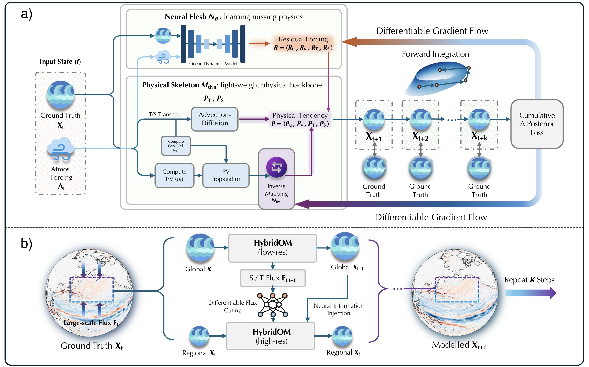

# <p align="center">🌊 HybridOM</p>

<p align="center">
  <b>Hybrid Physics-Based and Data-Driven Global Ocean Modeling with Efficient Spatial Downscaling</b>
</p>

<div align="center">

[](https://arxiv.org/abs/2602.00598)
[](https://icml.cc/)
[](https://github.com/ChiyodaMomo01/HybridOM)

</div>

<div align="center">
  
</div>

---

> **Abstract:** *Global ocean modeling is vital for climate science but struggles to balance computational efficiency with accuracy. Traditional numerical solvers are accurate but computationally expensive, while pure deep learning approaches, though fast, often lack physical consistency and long-term stability. To address this, we introduce HybridOM, a framework integrating a lightweight, differentiable numerical solver as a skeleton to enforce physical laws, with a neural network as the flesh to correct subgrid-scale dynamics. To enable efficient high-resolution modeling, we further introduce a physics-informed regional downscaling mechanism based on flux gating. This design achieves the inference efficiency of AI-based methods while preserving the accuracy and robustness of physical models. Extensive experiments on the GLORYS12V1 and OceanBench dataset validate HybridOM's performance in two distinct regimes: long-term subseasonal-to-seasonal simulation and short-term operational forecasting coupled with the FuXi-2.0 weather model. Results demonstrate that HybridOM achieves state-of-the-art accuracy while strictly maintaining physical consistency, offering a robust solution for next-generation ocean digital twins. Our source code is available at https://github.com/ChiyodaMomo01/HybridOM.*

## News

- **2026.05**: HybridOM has been accepted by **ICML 2026**.
- **2026.02**: Paper released on [arXiv](https://arxiv.org/abs/2602.00598).

## Authors

**Ruiqi Shu**<sup>1,2</sup>, **Xiaohui Zhong**<sup>3,2</sup>, **Qiusheng Huang**<sup>3,4,2</sup>, **Ruijian Gou**<sup>5</sup>, **Tianrun Gao**<sup>6,2</sup>, **Hao Li**<sup>3,4,2</sup>, **Xiaomeng Huang**<sup>1</sup>

<sup>1</sup>Department of Earth System Science, Tsinghua University, Beijing, China  
<sup>2</sup>Shanghai Academy of Artificial Intelligence for Science, Shanghai, China  
<sup>3</sup>Artificial Intelligence Innovation and Incubation Institute, Fudan University, Shanghai, China  
<sup>4</sup>Shanghai Innovation Institute, Shanghai, China  
<sup>5</sup>Laoshan National Laboratory, Qingdao, China  
<sup>6</sup>Department of Geotechnical Engineering, Tongji University, Shanghai, China

Correspondence: Xiaomeng Huang (`hxm@tsinghua.edu.cn`), Hao Li (`lihao_lh@fudan.edu.cn`)

## Overview

HybridOM is a global hybrid ocean model that embeds neural correction modules inside a lightweight differentiable physical solver. The physical skeleton evolves ocean states with explicit finite-volume dynamics, while the neural flesh compensates for unresolved subgrid-scale processes. For high-resolution regional modeling, HybridOM further introduces a flux-gated downscaling mechanism that transfers physically meaningful coarse-grid flux information into regional simulations.

This repository contains the official training and inference code for:

- **Global simulation and forecasting at 0.5 degrees**: `exp_main_05/`
- **Global high-resolution variant at 0.25 degrees**: `exp_main_025/`
- **Regional high-resolution downscaling**: `exp_spatial_highres/`
- **Differentiable dynamical cores**: `utils/`

## Requirements

- Python 3.9+
- PyTorch with `torch.distributed`
- CUDA/NCCL for multi-GPU training
- Common scientific Python packages used by the scripts, including `numpy`, `h5py`, `netCDF4`, `scipy`, `pyyaml`, and `tqdm`

For distributed experiments, we recommend launching with `torchrun`.

## Data Path Configuration

The code reads dataset locations from environment variables. Set the variables needed by the experiment you run:

| Variable | Used by | Description |
| --- | --- | --- |
| `HOM_GLORYS_05_H5_DIR` | `exp_main_05/`, `exp_spatial_highres/` | Global GLORYS directory containing `GLORYS_05_<YEAR>.h5` |
| `HOM_GLORYS_025_H5_DIR` | `exp_main_025/` | Global 0.25-degree GLORYS directory containing `GLORYS_025_<YEAR>.h5` |
| `HOM_GLORYS_REGIONAL_025_H5_DIR` | `exp_spatial_highres/` | Regional 0.25-degree GLORYS directory containing `GLORYS_pc_025_<YEAR>.h5` |
| `HOM_REGIONAL_MERGED_RESULTS_DIR` | `exp_spatial_highres/` | Global low-resolution simulation results used to drive regional downscaling |
| `HOM_ERA5_MEAN_SURFACE_DIR` | optional forcing | ERA5/WenHai-style atmospheric forcing directory |
| `HOM_CLIMATE_MEAN_NPY` | optional mean field | Path to `climate_mean_s_t_ssh.npy` when `mean_field: true` |

Masks, CMEMS initialization files, checkpoints, logs, and output directories are configured inside each experiment's `config.yaml`.

## Quick Start

Clone the repository:

```bash
git clone https://github.com/ChiyodaMomo01/HybridOM.git
cd HybridOM
```

### 0.5-Degree Global Experiment

Train:

```bash
export HOM_GLORYS_05_H5_DIR="/path/to/GLORYS/05/h5_dir"
# Optional:
# export HOM_ERA5_MEAN_SURFACE_DIR="/path/to/ERA5/mean_surface"
# export HOM_CLIMATE_MEAN_NPY="/path/to/climate_mean_s_t_ssh.npy"

cd exp_main_05
torchrun --standalone --nproc_per_node 8 train_hom.py
```

Inference:

```bash
export HOM_GLORYS_05_H5_DIR="/path/to/GLORYS/05/h5_dir"

cd exp_main_05
torchrun --standalone --nproc_per_node 8 inference_hom.py
```

### 0.25-Degree Global Experiment

Train:

```bash
export HOM_GLORYS_025_H5_DIR="/path/to/GLORYS/025/h5_dir"
# Optional:
# export HOM_ERA5_MEAN_SURFACE_DIR="/path/to/ERA5/mean_surface"
# export HOM_CLIMATE_MEAN_NPY="/path/to/climate_mean_s_t_ssh.npy"

cd exp_main_025
torchrun --standalone --nproc_per_node 8 train_hom.py
```

### Regional High-Resolution Downscaling

Train:

```bash
export HOM_GLORYS_05_H5_DIR="/path/to/GLORYS/05/h5_dir"
export HOM_GLORYS_REGIONAL_025_H5_DIR="/path/to/GLORYS/regional_025/h5_dir"
# Optional:
# export HOM_REGIONAL_MERGED_RESULTS_DIR="/path/to/merged_results_dir"
# export HOM_CLIMATE_MEAN_NPY="/path/to/climate_mean_s_t_ssh.npy"

cd exp_spatial_highres
torchrun --standalone --nproc_per_node 8 train_hom.py
```

Inference:

```bash
export HOM_GLORYS_05_H5_DIR="/path/to/GLORYS/05/h5_dir"
export HOM_GLORYS_REGIONAL_025_H5_DIR="/path/to/GLORYS/regional_025/h5_dir"

cd exp_spatial_highres
torchrun --standalone --nproc_per_node 8 inference_hom.py
```

## Repository Structure

```text
HybridOM/
|-- exp_main_05/              # 0.5-degree global HybridOM training/inference
|-- exp_main_025/             # 0.25-degree global HybridOM training
|-- exp_spatial_highres/      # Regional high-resolution downscaling
|-- utils/                    # Differentiable physical dynamical cores
|-- hybridom.png              # Main model overview figure
`-- README.md
```

## Baseline Models

Most baseline implementations used in our global and regional simulations are derived from the following open-source projects:

- [TurbL1_AI4Science](https://github.com/easylearningscores/TurbL1_AI4Science)
- [OpenSTL](https://github.com/chengtan9907/OpenSTL)
- [PastNet](https://github.com/easylearningscores/PastNet)
- [DiT](https://github.com/facebookresearch/DiT)
- [FourCastNet](https://github.com/NVlabs/FourCastNet)
- [NeuralOM](https://github.com/YuanGao-YG/NeuralOM)
- [WenHai](https://github.com/Cuiyingzhe/WenHai)
- [OneForecast](https://github.com/YuanGao-YG/OneForecast)
- [GraphCast](https://github.com/google-deepmind/graphcast)
- [OceanBench](https://github.com/mercator-ocean/oceanbench)

## Citation

If you find HybridOM useful, please cite:

```bibtex
@article{shu2026hybridom,
  title={HybridOM: Hybrid Physics-Based and Data-Driven Global Ocean Modeling with Efficient Spatial Downscaling},
  author={Shu, Ruiqi and Zhong, Xiaohui and Huang, Qiusheng and Gou, Ruijian and Gao, Tianrun and Li, Hao and Huang, Xiaomeng},
  journal={arXiv preprint arXiv:2602.00598},
  year={2026}
}
```
